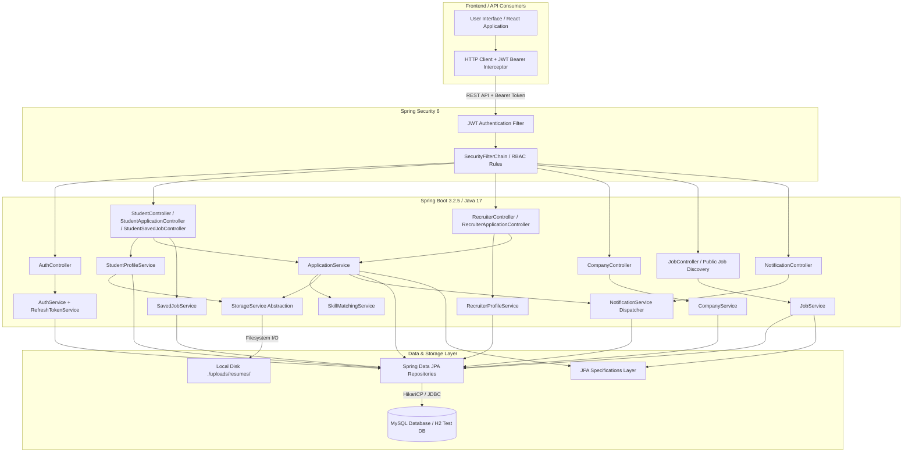
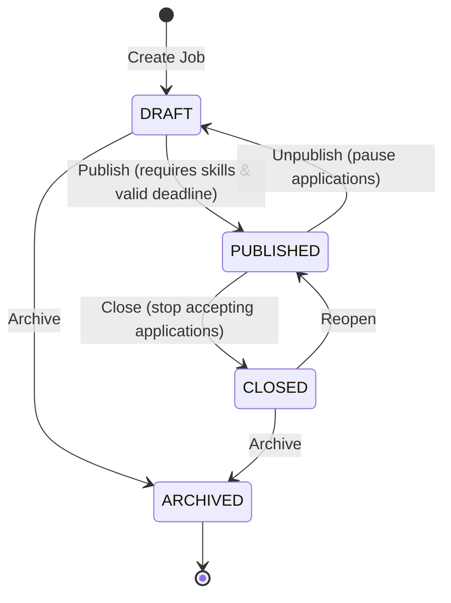
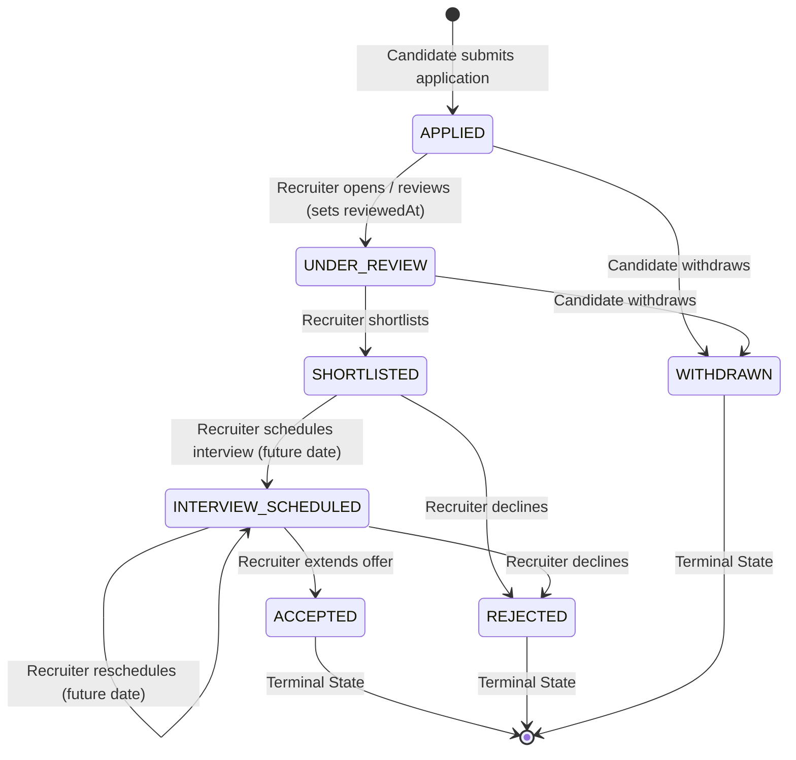

# CareerForge — Technical Architecture & System Blueprint

**Document Version:** 1.2.0  
**Project:** CareerForge — Intelligent Career & Recruitment Management Platform  
**Target Architecture:** Production-Grade Layered Java Full-Stack System  

---

## 1. System Requirements & Domain Analysis

CareerForge is an enterprise-ready career management and recruitment platform designed around three primary user personas: **Student**, **Recruiter**, and **Admin**. The platform provides automated candidate-job skill matching with deterministic gap analysis, full lifecycle applicant tracking (ATS), company profile management, resume storage abstraction, real-time platform notifications, and administrative moderation.

### 1.1 Persona Capability Matrix

| Role | Implemented Phase 1–4 Capabilities |
| :--- | :--- |
| **STUDENT** | - Professional Profile Management (Bio, Education, Experience, Skills, Certifications) with real-time completion % calculation.<br>- Multi-Resume Upload (Filesystem abstraction) with automatic active resume designation.<br>- Public Job Discovery with Dynamic Multi-Criteria Filtering & Sorting.<br>- Real-time Deterministic Skill-Matching Preview & Gap Breakdown.<br>- Job Bookmarking / Saved Jobs.<br>- Application Submission with Active Resume Fallback and Historical Score Snapshotting.<br>- Candidate Self-Withdrawal from early lifecycle states.<br>- Notification Inbox & Live Unread Counter. |
| **RECRUITER** | - Recruiter Profile & Company Registration.<br>- Company Profile Management (Name, Description, Industry, Size, Location, Website, Logo).<br>- Job Posting with Required and Optional Skills with Minimum Proficiency Levels.<br>- Complete Job State Machine (`DRAFT` $\leftrightarrow$ `PUBLISHED` $\leftrightarrow$ `CLOSED` $\rightarrow$ `ARCHIVED`).<br>- Recruiter Applicant Tracking System (ATS) Pipeline (`APPLIED` $\rightarrow$ `UNDER_REVIEW` $\rightarrow$ `SHORTLISTED` $\rightarrow$ `INTERVIEW_SCHEDULED` $\rightarrow$ `ACCEPTED` / `REJECTED`).<br>- Interview Scheduling and Rescheduling with Future Timestamp Enforcement.<br>- Private Recruiter Evaluation Notes (`recruiterNotes`).<br>- Company-Scoped Candidate Resume Download. |
| **ADMIN** | - System-wide seed accounts and role enforcement infrastructure (`ROLE_ADMIN`).<br>- Platform moderation and audit logging framework. |

---

## 2. High-Level Architecture Diagram



---

## 3. Database Entity Relationship Diagram

```mermaid
erDiagram
    USER ||--o| STUDENT_PROFILE : "has"
    USER ||--o| RECRUITER_PROFILE : "has"
    USER ||--o{ REFRESH_TOKEN : "issues"
    USER ||--o{ NOTIFICATION : "receives"
    COMPANY ||--o{ RECRUITER_PROFILE : "employs"
    COMPANY ||--o{ JOB : "posts"
    JOB ||--o{ JOB_SKILL : "requires"
    SKILL ||--o{ JOB_SKILL : "used in"
    STUDENT_PROFILE ||--o{ STUDENT_SKILL : "possesses"
    SKILL ||--o{ STUDENT_SKILL : "mapped to"
    STUDENT_PROFILE ||--o{ RESUME : "owns"
    STUDENT_PROFILE ||--o{ SAVED_JOB : "bookmarks"
    JOB ||--o{ SAVED_JOB : "bookmarked by"
    STUDENT_PROFILE ||--o{ APPLICATION : "submits"
    JOB ||--o{ APPLICATION : "receives"
    RESUME ||--o{ APPLICATION : "attached to"

    USER {
        bigint id PK
        string email UK
        string password_hash
        string role ENUM
        boolean enabled
        datetime created_at
        datetime updated_at
    }

    REFRESH_TOKEN {
        bigint id PK
        bigint user_id FK
        string token UK
        datetime expiry_date
        boolean revoked
        datetime created_at
    }

    NOTIFICATION {
        bigint id PK
        bigint user_id FK
        string title
        text message
        string type ENUM
        boolean is_read
        datetime created_at
    }

    STUDENT_PROFILE {
        bigint id PK
        bigint user_id FK,UK
        string first_name
        string last_name
        string phone
        string location
        text bio
        text education_summary
        string github_url
        string linkedin_url
        string portfolio_url
        int profile_completion_percentage
        datetime created_at
        datetime updated_at
    }

    COMPANY {
        bigint id PK
        string name UK
        string slug UK
        string website
        string logo_url
        text description
        string industry
        string company_size
        string location
        string verification_status ENUM
        datetime created_at
        datetime updated_at
    }

    RECRUITER_PROFILE {
        bigint id PK
        bigint user_id FK,UK
        bigint company_id FK
        string first_name
        string last_name
        string designation
        string department
        string phone
        boolean is_company_admin
        datetime created_at
        datetime updated_at
    }

    JOB {
        bigint id PK
        bigint company_id FK
        bigint recruiter_id FK
        string title
        string slug UK
        text description
        string location
        string work_mode ENUM
        string job_type ENUM
        string experience_level ENUM
        decimal salary_min
        decimal salary_max
        string currency
        string status ENUM
        datetime deadline
        datetime published_at
        datetime created_at
        datetime updated_at
    }

    SKILL {
        bigint id PK
        string name UK
        string category
    }

    STUDENT_SKILL {
        bigint id PK
        bigint student_profile_id FK
        bigint skill_id FK
        string proficiency ENUM
    }

    JOB_SKILL {
        bigint id PK
        bigint job_id FK
        bigint skill_id FK
        boolean is_required
        string minimum_proficiency ENUM
    }

    APPLICATION {
        bigint id PK
        bigint job_id FK
        bigint student_profile_id FK
        bigint resume_id FK
        string status ENUM
        decimal match_score_at_application
        text cover_letter
        text recruiter_notes
        datetime interview_scheduled_at
        datetime reviewed_at
        datetime withdrawn_at
        datetime created_at
        datetime updated_at
    }

    SAVED_JOB {
        bigint id PK
        bigint student_profile_id FK
        bigint job_id FK
        datetime created_at
    }

    RESUME {
        bigint id PK
        bigint student_profile_id FK
        string original_file_name
        string stored_file_name
        string storage_path
        string content_type
        bigint file_size
        int version
        boolean is_active
        datetime uploaded_at
    }
```

---

## 4. State Machines & Lifecycle Blueprints

### 4.1 Job Lifecycle State Machine



### 4.2 Application Lifecycle State Machine



---

## 5. Skill Matching Engine Specification

The skill-matching engine (`SkillMatchingServiceImpl`) computes deterministic, multi-factor compatibility between candidate profiles and job requirements.

### Formula
$$\text{Score} = \left( \frac{\sum_{k \in \text{Job Skills}} (W_k \times \mu_k)}{\sum_{j \in \text{Job Skills}} W_j} \right) \times 100$$

### Weighting & Scaling Rules
- **Required Skill Weight ($W_{\text{req}}$)**: `2.0`
- **Optional Skill Weight ($W_{\text{opt}}$)**: `1.0`
- **Proficiency Levels**: `BEGINNER` = 1, `INTERMEDIATE` = 2, `ADVANCED` = 3, `EXPERT` = 4
- **Proficiency Multiplier ($\mu_k$)**:
  $$\mu_k = \min\left(1.0, \frac{\text{Student Proficiency}}{\text{Job Required Proficiency}}\right)$$
  *(If student does not have skill $k$, $\mu_k = 0.0$)*
- **Eligibility Threshold Rule**:
  $$\text{Eligible} = (\text{Score} \ge 50.00\%) \land (\text{Total Required Skills} == 0 \lor \text{Matched Required Skills} \ge 1)$$
- **Boundary Handling**:
  - Zero-skill job $\rightarrow$ `100.00%`, `eligible = true`
  - Zero-skill candidate $\rightarrow$ `0.00%`, `eligible = false`
- **Rounding**: `BigDecimal` scaled to 2 decimal places with `RoundingMode.HALF_UP`.

---

## 6. Security, RBAC & Cross-Tenant Ownership Boundaries

1. **Authentication Principle**:
   - Stateless JWT authentication via `JwtAuthenticationFilter`.
   - Security principal resolved as `UserPrincipal` containing `id`, `email`, and `authorities`.
2. **Student Ownership Isolation**:
   - Student profile, sub-resources, applications, bookmarks, and notifications are filtered strictly by `user_id` or `student_profile_id`.
   - Unauthorized cross-student access throws `ResourceNotFoundException` $\rightarrow$ mapped to **`404 Not Found`** by `GlobalExceptionHandler`.
3. **Recruiter Cross-Company Isolation**:
   - Recruiter operations (job management, applicant listing, dossier inspection, status updates, evaluation notes, resume streaming) verify:
     $$\text{application.job.company.id} == \text{recruiter.company.id}$$
   - Attempted access across company boundaries returns **`404 Not Found`** to completely mask existence and prevent ID enumeration.
4. **Internal Evaluation Notes Privacy**:
   - `recruiterNotes` is strictly excluded from all student-facing DTOs (`StudentApplicationResponse`, `StudentApplicationDetailResponse`) and platform notifications.

---

## 7. Performance & N+1 Prevention Strategy

1. **Job Discovery**: `JobSpecification` dynamically joins search criteria while skills for all returned jobs on the page are batch-fetched in a single query via `JobSkillRepository.findAllByJob_IdInWithSkill(jobIds)`.
2. **Saved Jobs**: `SavedJobRepository.findAllByStudentProfile_Id` uses `@EntityGraph(attributePaths = {"job", "job.company"})` and batch-loads skills via `JobSkillRepository`.
3. **Student Applications**: `ApplicationRepository.findAllByStudentProfile_Id` uses `@EntityGraph(attributePaths = {"job", "job.company", "resume"})`.
4. **Recruiter Applicant Tracking**: Detail queries utilize eager EntityGraphs `attributePaths = {"job", "job.company", "resume", "studentProfile", "studentProfile.user"}`.
5. **Skill Matching Engine**: `StudentSkillRepository` and `JobSkillRepository` use `JOIN FETCH js.skill` to load all skills in 2 single queries total.

---

## 8. Integration Testing Architecture

- **Test Suite Location**: `src/test/java/com/careerforge/integration/Phase4EndToEndWorkflowIntegrationTest.java`
- **Total Baseline Tests**: **103 Automated Tests** across unit, controller, integration, and E2E tiers.
- **Coverage**: 100% of the cross-module journey (Student registration $\rightarrow$ Profile setup $\rightarrow$ Recruiter company/job creation $\rightarrow$ Public discovery $\rightarrow$ Skill matching $\rightarrow$ Application submission $\rightarrow$ Snapshot score $\rightarrow$ ATS state machine $\rightarrow$ Interview scheduling $\rightarrow$ Resume streaming $\rightarrow$ Notifications $\rightarrow$ Saved jobs $\rightarrow$ Cross-tenant security isolation).
