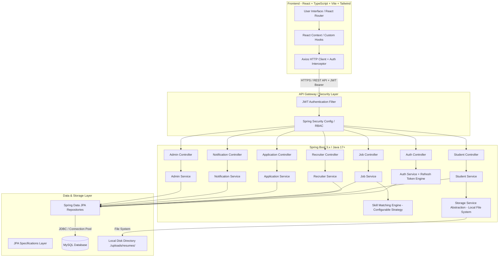

# CareerForge — Technical Architecture & System Blueprint

**Document Version:** 1.1.0  
**Project:** CareerForge — Intelligent Career & Recruitment Management Platform  
**Target Architecture:** Production-Grade Layered Java Full-Stack System  

---

## 1. System Requirements & Domain Analysis

CareerForge is an enterprise-ready career management and recruitment platform designed around three primary user personas: **Student**, **Recruiter**, and **Admin**. The platform provides automated job recommendations, candidate-job skill matching with gap analysis, lifecycle application tracking, company management, resume storage abstraction, real-time platform notifications, and administrative audit logging.

### 1.1 Persona Capability Matrix

| Role | Key Capabilities & Features |
| :--- | :--- |
| **STUDENT** | - Professional Profile Management (Education, Experience, Skills, Certifications)<br>- Multi-Resume Upload (Local Storage Abstraction) & Primary Resume Selection<br>- Job Search with Dynamic Filtering & Sorting<br>- Configurable Rule-Based Job Recommendation Engine & Skill-Gap Analysis<br>- Job Bookmarking / Saved Jobs<br>- Application Submission & Real-time Lifecycle Tracking<br>- Platform Notifications (Application status changes, interview invites)<br>- Student Dashboard Analytics |
| **RECRUITER** | - Recruiter Profile & Company Verification Request<br>- Company Profile Management (Logo, Description, Industry, Website)<br>- Job Posting with Required Skills & Minimum Proficiency Levels<br>- Applicant Screening & Candidate Compatibility Filtering<br>- Multi-Stage Application Pipeline Management (APPLIED → SHORTLISTED → INTERVIEW → SELECTED/REJECTED)<br>- Recruiter Recruitment Analytics Dashboard |
| **ADMIN** | - Platform Management (User, Recruiter & Company moderation)<br>- Account Activation / Deactivation & Role Management<br>- Job Moderation & Flagging<br>- System-Wide Audit Log Inspection & System Notifications<br>- Platform KPI Analytics Dashboard |

---

## 2. High-Level Architecture Diagram



---

## 3. Database ER Design & Entity Schemas

### 3.1 Entity Relationship Diagram

```mermaid
erDiagram
    USER ||--o| STUDENT_PROFILE : "has"
    USER ||--o| RECRUITER_PROFILE : "has"
    USER ||--o{ REFRESH_TOKEN : "issues"
    USER ||--o{ NOTIFICATION : "receives"
    COMPANY ||--o{ RECRUITER_PROFILE : "employs"
    COMPANY ||--o{ JOB : "posts"
    JOB ||--o{ JOB_SKILL : "requires"
    SKILL ||--o{ JOB_SKILL : "used in"
    STUDENT_PROFILE ||--o{ STUDENT_SKILL : "possesses"
    SKILL ||--o{ STUDENT_SKILL : "mapped to"
    STUDENT_PROFILE ||--o{ RESUME : "owns"
    STUDENT_PROFILE ||--o{ SAVED_JOB : "bookmarks"
    JOB ||--o{ SAVED_JOB : "bookmarked by"
    STUDENT_PROFILE ||--o{ APPLICATION : "submits"
    JOB ||--o{ APPLICATION : "receives"
    APPLICATION ||--o{ APPLICATION_STATUS_HISTORY : "tracks"
    USER ||--o{ AUDIT_LOG : "triggers"

    USER {
        bigint id PK
        string email UK
        string password_hash
        string role ENUM
        boolean enabled
        datetime created_at
        datetime updated_at
    }

    REFRESH_TOKEN {
        bigint id PK
        bigint user_id FK
        string token UK
        datetime expiry_date
        boolean revoked
        datetime created_at
    }

    NOTIFICATION {
        bigint id PK
        bigint user_id FK
        string title
        text message
        string type ENUM
        boolean is_read
        datetime created_at
    }

    STUDENT_PROFILE {
        bigint id PK
        bigint user_id FK,UK
        string first_name
        string last_name
        string phone
        string headline
        text summary
        string github_url
        string linkedin_url
        datetime created_at
        datetime updated_at
    }

    COMPANY {
        bigint id PK
        string name UK
        string website
        string logo_url
        text description
        string industry
        string status ENUM
        datetime created_at
        datetime updated_at
    }

    RECRUITER_PROFILE {
        bigint id PK
        bigint user_id FK,UK
        bigint company_id FK
        string designation
        boolean is_company_admin
        datetime created_at
        datetime updated_at
    }

    JOB {
        bigint id PK
        bigint company_id FK
        bigint recruiter_id FK
        string title
        text description
        string location
        string job_type ENUM
        string experience_level ENUM
        decimal salary_min
        decimal salary_max
        string status ENUM
        datetime deadline
        datetime created_at
        datetime updated_at
    }

    SKILL {
        bigint id PK
        string name UK
        string category
    }

    STUDENT_SKILL {
        bigint id PK
        bigint student_id FK
        bigint skill_id FK
        string proficiency ENUM
    }

    JOB_SKILL {
        bigint id PK
        bigint job_id FK
        bigint skill_id FK
        boolean is_required
        string minimum_proficiency ENUM
    }

    APPLICATION {
        bigint id PK
        bigint job_id FK
        bigint student_id FK
        bigint resume_id FK
        string status ENUM
        decimal match_score
        datetime applied_at
        datetime updated_at
    }

    APPLICATION_STATUS_HISTORY {
        bigint id PK
        bigint application_id FK
        string status ENUM
        string notes
        bigint changed_by_user_id FK
        datetime created_at
    }

    RESUME {
        bigint id PK
        bigint student_id FK
        string file_name
        string file_path
        string file_type
        bigint file_size
        boolean is_primary
        datetime uploaded_at
    }
```

### 3.2 Key Database Entity Definitions

1. **`users`**:
   - `id` BIGINT AUTO_INCREMENT PRIMARY KEY
   - `email` VARCHAR(150) NOT NULL UNIQUE
   - `password_hash` VARCHAR(255) NOT NULL
   - `role` VARCHAR(20) NOT NULL (`ROLE_STUDENT`, `ROLE_RECRUITER`, `ROLE_ADMIN`)
   - `enabled` BOOLEAN NOT NULL DEFAULT TRUE
   - `created_at` TIMESTAMP DEFAULT CURRENT_TIMESTAMP, `updated_at` TIMESTAMP DEFAULT CURRENT_TIMESTAMP ON UPDATE CURRENT_TIMESTAMP
   - *Indexes*: `idx_users_email` (`email`), `idx_users_role` (`role`)

2. **`refresh_tokens`**:
   - `id` BIGINT AUTO_INCREMENT PRIMARY KEY
   - `user_id` BIGINT NOT NULL, FK -> `users(id)` ON DELETE CASCADE
   - `token` VARCHAR(255) NOT NULL UNIQUE
   - `expiry_date` TIMESTAMP NOT NULL
   - `revoked` BOOLEAN NOT NULL DEFAULT FALSE
   - `created_at` TIMESTAMP DEFAULT CURRENT_TIMESTAMP
   - *Indexes*: `idx_ref_token` (`token`), `idx_ref_token_user` (`user_id`)

3. **`notifications`**:
   - `id` BIGINT AUTO_INCREMENT PRIMARY KEY
   - `user_id` BIGINT NOT NULL, FK -> `users(id)` ON DELETE CASCADE
   - `title` VARCHAR(150) NOT NULL
   - `message` TEXT NOT NULL
   - `type` VARCHAR(50) NOT NULL (`APPLICATION_UPDATE`, `SYSTEM_ALERT`, `INTERVIEW_INVITE`, `JOB_RECOMMENDATION`)
   - `is_read` BOOLEAN NOT NULL DEFAULT FALSE
   - `created_at` TIMESTAMP DEFAULT CURRENT_TIMESTAMP
   - *Indexes*: `idx_notif_user` (`user_id`), `idx_notif_read` (`is_read`)

---

## 4. Backend Package Architecture (Spring Boot)

```
com.careerforge
├── CareerForgeApplication.java
├── config
│   ├── ApplicationConfig.java
│   ├── SecurityConfig.java
│   ├── JwtConfigProperties.java
│   ├── MatchingConfigProperties.java
│   ├── StorageConfigProperties.java
│   └── WebMvcConfig.java
├── controller
│   ├── AuthController.java
│   ├── StudentController.java
│   ├── RecruiterController.java
│   ├── CompanyController.java
│   ├── JobController.java
│   ├── ApplicationController.java
│   ├── ResumeController.java
│   ├── SkillController.java
│   ├── NotificationController.java
│   ├── RecommendationController.java
│   ├── AnalyticsController.java
│   └── AdminController.java
├── dto
│   ├── request
│   │   ├── RegisterRequest.java
│   │   ├── LoginRequest.java
│   │   ├── RefreshTokenRequest.java
│   │   ├── StudentProfileUpdateRequest.java
│   │   ├── CompanyRequest.java
│   │   ├── JobCreateUpdateRequest.java
│   │   ├── ApplicationStatusChangeRequest.java
│   │   └── SkillRequest.java
│   └── response
│       ├── ApiResponse.java
│       ├── PagedResponse.java
│       ├── AuthResponse.java
│       ├── TokenRefreshResponse.java
│       ├── UserResponse.java
│       ├── NotificationResponse.java
│       ├── StudentProfileResponse.java
│       ├── RecruiterProfileResponse.java
│       ├── CompanyResponse.java
│       ├── JobResponse.java
│       ├── ApplicationResponse.java
│       ├── MatchScoreResponse.java
│       ├── SkillGapResponse.java
│       └── AnalyticsResponse.java
├── entity
│   ├── BaseEntity.java
│   ├── User.java
│   ├── RefreshToken.java
│   ├── Notification.java
│   ├── StudentProfile.java
│   ├── RecruiterProfile.java
│   ├── Company.java
│   ├── Job.java
│   ├── Skill.java
│   ├── StudentSkill.java
│   ├── JobSkill.java
│   ├── Application.java
│   ├── ApplicationStatusHistory.java
│   ├── Resume.java
│   ├── SavedJob.java
│   ├── AuditLog.java
│   └── enums
│       ├── Role.java
│       ├── CompanyStatus.java
│       ├── JobStatus.java
│       ├── JobType.java
│       ├── ExperienceLevel.java
│       ├── SkillProficiency.java
│       ├── ApplicationStatus.java
│       └── NotificationType.java
├── exception
│   ├── GlobalExceptionHandler.java
│   ├── ResourceNotFoundException.java
│   ├── BadRequestException.java
│   ├── UnauthorizedException.java
│   ├── TokenRefreshException.java
│   ├── DuplicateResourceException.java
│   └── FileStorageException.java
├── mapper
│   ├── UserMapper.java
│   ├── StudentMapper.java
│   ├── RecruiterMapper.java
│   ├── CompanyMapper.java
│   ├── JobMapper.java
│   ├── ApplicationMapper.java
│   └── NotificationMapper.java
├── repository
│   ├── UserRepository.java
│   ├── RefreshTokenRepository.java
│   ├── NotificationRepository.java
│   ├── StudentProfileRepository.java
│   ├── RecruiterProfileRepository.java
│   ├── CompanyRepository.java
│   ├── JobRepository.java
│   ├── SkillRepository.java
│   ├── StudentSkillRepository.java
│   ├── JobSkillRepository.java
│   ├── ApplicationRepository.java
│   ├── ApplicationStatusHistoryRepository.java
│   ├── ResumeRepository.java
│   ├── SavedJobRepository.java
│   └── AuditLogRepository.java
├── security
│   ├── CustomUserDetailsService.java
│   ├── JwtTokenProvider.java
│   ├── JwtAuthenticationFilter.java
│   ├── JwtAuthenticationEntryPoint.java
│   └── UserPrincipal.java
├── service
│   ├── AuthService.java
│   ├── RefreshTokenService.java
│   ├── StudentService.java
│   ├── RecruiterService.java
│   ├── CompanyService.java
│   ├── JobService.java
│   ├── ApplicationService.java
│   ├── NotificationService.java
│   ├── SkillMatchingService.java
│   ├── StorageService.java
│   ├── AnalyticsService.java
│   ├── AuditLogService.java
│   └── impl
│       ├── AuthServiceImpl.java
│       ├── RefreshTokenServiceImpl.java
│       ├── StudentServiceImpl.java
│       ├── RecruiterServiceImpl.java
│       ├── CompanyServiceImpl.java
│       ├── JobServiceImpl.java
│       ├── ApplicationServiceImpl.java
│       ├── NotificationServiceImpl.java
│       ├── SkillMatchingServiceImpl.java
│       ├── LocalStorageServiceImpl.java
│       ├── AnalyticsServiceImpl.java
│       └── AuditLogServiceImpl.java
├── specification
│   ├── JobSpecification.java
│   └── ApplicationSpecification.java
└── util
    ├── AppConstants.java
    └── SecurityUtils.java
```

---

## 5. REST API Endpoint Specification (Authentication & Refresh Tokens)

### 5.1 Authentication Module (`/api/v1/auth`)
- `POST /api/v1/auth/register` — Register new user (Student / Recruiter). Response: `AuthResponse (accessToken, refreshToken, userDetails)`.
- `POST /api/v1/auth/login` — Authenticate user credentials. Response: `AuthResponse (accessToken, refreshToken, userDetails)`.
- `POST /api/v1/auth/refresh` — Refresh short-lived JWT access token using valid refresh token. Request: `RefreshTokenRequest`. Response: `TokenRefreshResponse`.
- `POST /api/v1/auth/logout` — Revoke active refresh token.
- `GET /api/v1/auth/me` — Fetch current authenticated user info.

---

## 6. Configurable & Testable Skill-Matching Algorithm

The skill-matching calculation is isolated in `SkillMatchingServiceImpl` and injected with `MatchingConfigProperties` (configured via `application.yml` / env vars):

```yaml
careerforge:
  matching:
    required-skill-weight: 2.0
    optional-skill-weight: 1.0
    proficiency-weight-multiplier: 1.0
```

### Formula
$$\text{Compatibility Score } (S) = \left( \frac{\sum_{k \in S_C \cap S_J} (W_k \times \mu_k)}{\sum_{k \in S_J} W_k} \right) \times 100$$

Where $\mu_k = \min\left(1.0, \frac{\text{Candidate Proficiency}}{\text{Job Required Proficiency}}\right)$.

---

## 7. Development Seed Data Specification

During local development setup, if the database has zero records, `DataInitializer` populates:
1. **Sample Skills**: Java, Spring Boot, React, TypeScript, MySQL, Docker, REST API, Git, Python, Microservices.
2. **Development Seed Accounts** (Clearly tagged as dev-only, BCrypt hashed):
   - **Admin**: `admin@careerforge.local` / `DevPass123!` (Role: `ROLE_ADMIN`)
   - **Recruiter**: `recruiter@careerforge.local` / `DevPass123!` (Role: `ROLE_RECRUITER`)
   - **Student**: `student@careerforge.local` / `DevPass123!` (Role: `ROLE_STUDENT`)

> [!WARNING]
> Seeded passwords are strictly marked as development-only and are prohibited from use in production environments.

---

**End of Document**
