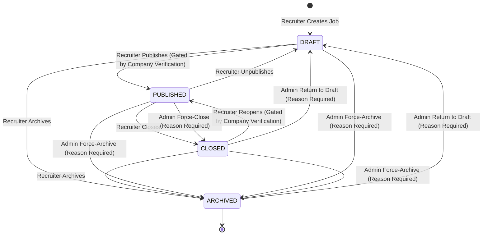
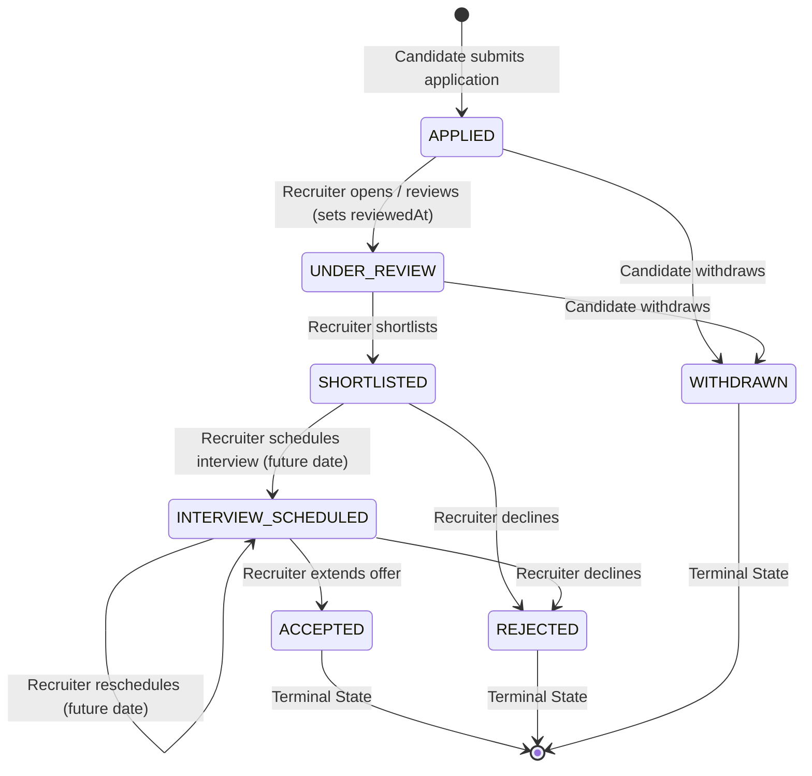
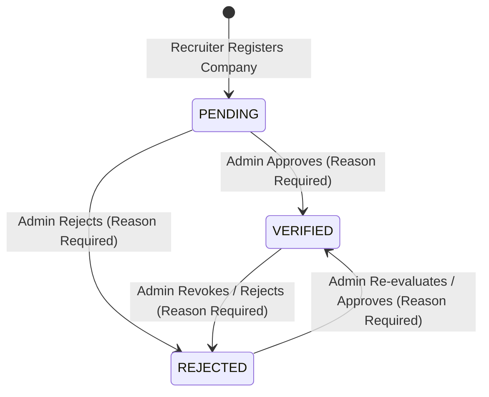
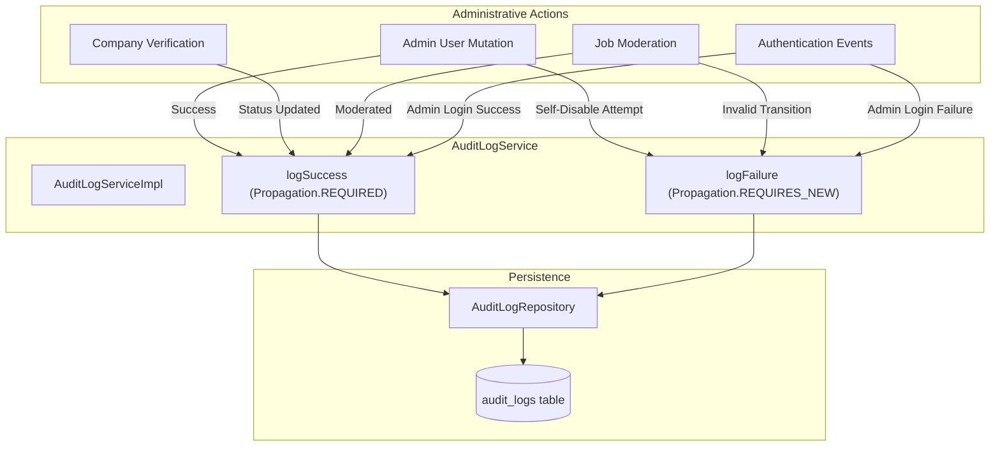
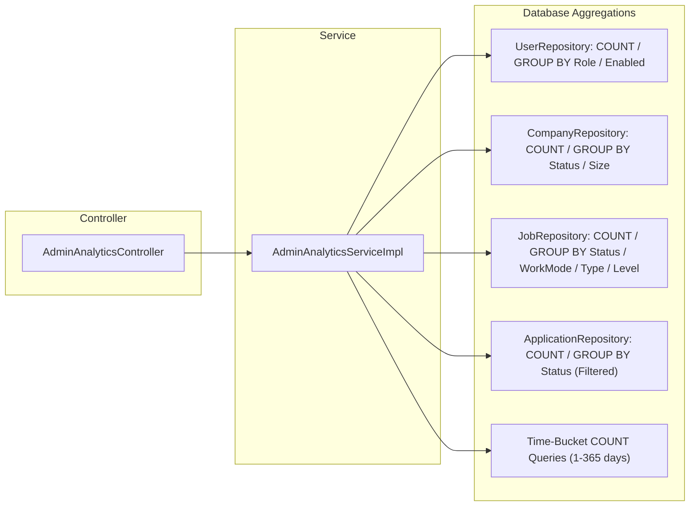

# CareerForge — Technical Architecture & System Blueprint

**Document Version:** 1.5.0  
**Project:** CareerForge — Intelligent Career & Recruitment Management Platform  
**Target Architecture:** Production-Grade Layered Java Full-Stack System  

---

## 1. System Requirements & Domain Analysis

CareerForge is an enterprise-ready career management and recruitment platform designed around three primary user personas: **Student**, **Recruiter**, and **Admin**. The platform provides automated candidate-job skill matching with deterministic gap analysis, full lifecycle applicant tracking (ATS), company profile management, resume storage abstraction, real-time platform notifications, administrative governance, company verification, content moderation, security audit logging, and server-side platform analytics.

### 1.1 Persona Capability Matrix

| Role | Implemented Phase 1–5 Capabilities |
| :--- | :--- |
| **STUDENT** | - Professional Profile Management (Bio, Education, Experience, Skills, Certifications) with real-time completion % calculation.<br>- Multi-Resume Upload (Filesystem abstraction) with automatic active resume designation.<br>- Public Job Discovery with Dynamic Multi-Criteria Filtering & Sorting.<br>- Real-time Deterministic Skill-Matching Preview & Gap Breakdown.<br>- Job Bookmarking / Saved Jobs.<br>- Application Submission with Active Resume Fallback and Historical Score Snapshotting.<br>- Candidate Self-Withdrawal from early lifecycle states.<br>- Notification Inbox & Live Unread Counter. |
| **RECRUITER** | - Recruiter Profile & Company Registration.<br>- Company Profile Management (Name, Description, Industry, Size, Location, Website, Logo).<br>- Job Posting with Required and Optional Skills with Minimum Proficiency Levels.<br>- Complete Job State Machine (`DRAFT` $\leftrightarrow$ `PUBLISHED` $\leftrightarrow$ `CLOSED` $\rightarrow$ `ARCHIVED`), with publishing gated by company verification.<br>- Recruiter Applicant Tracking System (ATS) Pipeline (`APPLIED` $\rightarrow$ `UNDER_REVIEW` $\rightarrow$ `SHORTLISTED` $\rightarrow$ `INTERVIEW_SCHEDULED` $\rightarrow$ `ACCEPTED` / `REJECTED`).<br>- Interview Scheduling and Rescheduling with Future Timestamp Enforcement.<br>- Private Recruiter Evaluation Notes (`recruiterNotes`).<br>- Company-Scoped Candidate Resume Download. |
| **ADMIN** | - Platform User Directory with search, multi-criteria filtering, and detailed profile inspection.<br>- Account status management (`enable`/`disable`) with mandatory reason and self-disablement protection.<br>- Company Verification State Machine (`PENDING` $\leftrightarrow$ `VERIFIED` $\leftrightarrow$ `REJECTED`) with recruiter alerts.<br>- Job Content Moderation State Machine (`FORCE_CLOSE`, `FORCE_ARCHIVE`, `RETURN_TO_DRAFT`).<br>- Append-Only Security Audit Trail with transaction isolation (`Propagation.REQUIRES_NEW` for failure audits).<br>- Authentication event listener tracking admin login successes and failures.<br>- Database-Aggregated Platform Analytics (Overview KPIs, Funnel Analysis, Job/Company/User distributions, Time-Series Trends). |

---

## 2. High-Level Architecture Diagram

```mermaid
graph TD
    subgraph Client Layer [Frontend / API Consumers]
        UI[User Interface / React Application]
        Axios[HTTP Client + JWT Bearer Interceptor]
        UI --> Axios
    end

    subgraph API Gateway & Security Layer [Spring Security 6]
        JWTFilter[JWT Authentication Filter]
        SecConfig[SecurityFilterChain / RBAC Rules]
        AuthListener[AuthenticationAuditEventListener]
        Axios -->|REST API + Bearer Token| JWTFilter
        JWTFilter --> SecConfig
        SecConfig -->|Auth Events| AuthListener
    end

    subgraph Backend Application Layer [Spring Boot 3.2.5 / Java 17]
        SecConfig --> AuthCtrl[AuthController]
        SecConfig --> StudCtrl[StudentController / StudentApplicationController / StudentSavedJobController]
        SecConfig --> RecCtrl[RecruiterController / RecruiterApplicationController]
        SecConfig --> CompCtrl[CompanyController]
        SecConfig --> JobCtrl[JobController / Public Job Discovery]
        SecConfig --> NotifCtrl[NotificationController]
        SecConfig --> AdminUserCtrl[AdminUserController]
        SecConfig --> AdminModCtrl[AdminModerationController]
        SecConfig --> AdminAuditCtrl[AdminAuditLogController]
        SecConfig --> AdminAnalyticsCtrl[AdminAnalyticsController]

        AuthCtrl --> AuthService[AuthService + RefreshTokenService]
        StudCtrl --> StudService[StudentProfileService]
        StudCtrl --> AppService[ApplicationService]
        StudCtrl --> SavedJobService[SavedJobService]
        RecCtrl --> RecService[RecruiterProfileService]
        RecCtrl --> AppService
        CompCtrl --> CompService[CompanyService]
        JobCtrl --> JobService[JobService]
        NotifCtrl --> NotifService[NotificationService]

        AdminUserCtrl --> AdminUserService[AdminUserService]
        AdminModCtrl --> AdminModService[AdminModerationService]
        AdminAuditCtrl --> AuditLogService[AuditLogService]
        AdminAnalyticsCtrl --> AdminAnalyticsService[AdminAnalyticsService]
        AuthListener --> AuditLogService

        AdminUserService --> AuditLogService
        AdminModService --> AuditLogService
        JobService --> AuditLogService
        AdminModService --> NotifService
        AppService --> MatchEngine[SkillMatchingService]
        AppService --> StorageService[StorageService Abstraction]
        AppService --> NotifService
        StudService --> StorageService
    end

    subgraph Data & Storage Layer
        Repo[Spring Data JPA Repositories]
        Spec[JPA Specifications Layer]
        
        AuthService --> Repo
        StudService --> Repo
        RecService --> Repo
        CompService --> Repo
        JobService --> Repo
        AppService --> Repo
        SavedJobService --> Repo
        NotifService --> Repo
        AdminUserService --> Repo
        AdminModService --> Repo
        AuditLogService --> Repo
        AdminAnalyticsService --> Repo
        JobService --> Spec
        AppService --> Spec
        AdminUserService --> Spec
        AdminModService --> Spec
        AuditLogService --> Spec

        Repo -->|HikariCP / JDBC| MySQL[(MySQL Database / H2 Test DB)]
        StorageService -->|Filesystem I/O| DiskStorage[Local Disk ./uploads/resumes/]
    end
```



---

## 3. Database Entity Relationship Diagram

```mermaid
erDiagram
    USER ||--o| STUDENT_PROFILE : "has"
    USER ||--o| RECRUITER_PROFILE : "has"
    USER ||--o{ REFRESH_TOKEN : "issues"
    USER ||--o{ NOTIFICATION : "receives"
    COMPANY ||--o{ RECRUITER_PROFILE : "employs"
    COMPANY ||--o{ JOB : "posts"
    JOB ||--o{ JOB_SKILL : "requires"
    SKILL ||--o{ JOB_SKILL : "used in"
    STUDENT_PROFILE ||--o{ STUDENT_SKILL : "possesses"
    SKILL ||--o{ STUDENT_SKILL : "mapped to"
    STUDENT_PROFILE ||--o{ RESUME : "owns"
    STUDENT_PROFILE ||--o{ SAVED_JOB : "bookmarks"
    JOB ||--o{ SAVED_JOB : "bookmarked by"
    STUDENT_PROFILE ||--o{ APPLICATION : "submits"
    JOB ||--o{ APPLICATION : "receives"
    RESUME ||--o{ APPLICATION : "attached to"

    USER {
        bigint id PK
        string email UK
        string password_hash
        string role ENUM
        boolean enabled
        datetime created_at
        datetime updated_at
    }

    REFRESH_TOKEN {
        bigint id PK
        bigint user_id FK
        string token UK
        datetime expiry_date
        boolean revoked
        datetime created_at
    }

    NOTIFICATION {
        bigint id PK
        bigint user_id FK
        string title
        text message
        string type ENUM
        boolean is_read
        datetime created_at
    }

    STUDENT_PROFILE {
        bigint id PK
        bigint user_id FK,UK
        string first_name
        string last_name
        string phone
        string location
        text bio
        text education_summary
        string github_url
        string linkedin_url
        string portfolio_url
        int profile_completion_percentage
        datetime created_at
        datetime updated_at
    }

    COMPANY {
        bigint id PK
        string name UK
        string slug UK
        string website
        string logo_url
        text description
        string industry
        string company_size
        string location
        string verification_status ENUM
        datetime created_at
        datetime updated_at
    }

    RECRUITER_PROFILE {
        bigint id PK
        bigint user_id FK,UK
        bigint company_id FK
        string first_name
        string last_name
        string designation
        string department
        string phone
        boolean is_company_admin
        datetime created_at
        datetime updated_at
    }

    JOB {
        bigint id PK
        bigint company_id FK
        bigint recruiter_id FK
        string title
        string slug UK
        text description
        string location
        string work_mode ENUM
        string job_type ENUM
        string experience_level ENUM
        decimal salary_min
        decimal salary_max
        string currency
        string status ENUM
        datetime deadline
        datetime published_at
        datetime created_at
        datetime updated_at
    }

    SKILL {
        bigint id PK
        string name UK
        string category
    }

    STUDENT_SKILL {
        bigint id PK
        bigint student_profile_id FK
        bigint skill_id FK
        string proficiency ENUM
    }

    JOB_SKILL {
        bigint id PK
        bigint job_id FK
        bigint skill_id FK
        boolean is_required
        string minimum_proficiency ENUM
    }

    APPLICATION {
        bigint id PK
        bigint job_id FK
        bigint student_profile_id FK
        bigint resume_id FK
        string status ENUM
        decimal match_score_at_application
        text cover_letter
        text recruiter_notes
        datetime interview_scheduled_at
        datetime reviewed_at
        datetime withdrawn_at
        datetime created_at
        datetime updated_at
    }

    SAVED_JOB {
        bigint id PK
        bigint student_profile_id FK
        bigint job_id FK
        datetime created_at
    }

    RESUME {
        bigint id PK
        bigint student_profile_id FK
        string original_file_name
        string stored_file_name
        string storage_path
        string content_type
        bigint file_size
        int version
        boolean is_active
        datetime uploaded_at
    }

    AUDIT_LOG {
        bigint id PK
        bigint actor_user_id
        string actor_email
        string actor_role
        string event_type ENUM
        string target_entity_type ENUM
        bigint target_entity_id
        string target_identifier
        string status ENUM
        string reason
        text details
        string ip_address
        string user_agent
        datetime created_at
    }
```

---

## 4. State Machines & Lifecycle Blueprints

### 4.1 Job Lifecycle State Machine (Recruiter & Admin)



### 4.2 Application Lifecycle State Machine (ATS)



### 4.3 Company Verification State Machine



---

## 5. Skill Matching Engine Specification

The skill-matching engine (`SkillMatchingServiceImpl`) computes deterministic, multi-factor compatibility between candidate profiles and job requirements.

### Formula
$$\text{Score} = \left( \frac{\sum_{k \in \text{Job Skills}} (W_k \times \mu_k)}{\sum_{j \in \text{Job Skills}} W_j} \right) \times 100$$

### Weighting & Scaling Rules
- **Required Skill Weight ($W_{\text{req}}$)**: `2.0`
- **Optional Skill Weight ($W_{\text{opt}}$)**: `1.0`
- **Proficiency Levels**: `BEGINNER` = 1, `INTERMEDIATE` = 2, `ADVANCED` = 3, `EXPERT` = 4
- **Proficiency Multiplier ($\mu_k$)**:
  $$\mu_k = \min\left(1.0, \frac{\text{Student Proficiency}}{\text{Job Required Proficiency}}\right)$$
  *(If student does not have skill $k$, $\mu_k = 0.0$)*
- **Eligibility Threshold Rule**:
  $$\text{Eligible} = (\text{Score} \ge 50.00\%) \land (\text{Total Required Skills} == 0 \lor \text{Matched Required Skills} \ge 1)$$
- **Boundary Handling**:
  - Zero-skill job $\rightarrow$ `100.00%`, `eligible = true`
  - Zero-skill candidate $\rightarrow$ `0.00%`, `eligible = false`
- **Rounding**: `BigDecimal` scaled to 2 decimal places with `RoundingMode.HALF_UP`.

---

## 6. Administrative Governance, Audit Logging & Security Topology



### 6.1 Transaction Isolation Guarantees
1. **Coupled Success Audits**: `logSuccess` executes with `@Transactional(propagation = Propagation.REQUIRED)`, guaranteeing that the audit record is committed atomically alongside the business mutation.
2. **Rollback-Resilient Failure Audits**: `logFailure` executes with `@Transactional(propagation = Propagation.REQUIRES_NEW)`. When an administrative operation fails (e.g. self-disable attempt, invalid moderation transition), the outer business transaction rolls back, but the failure audit log commits independently to preserve the forensic record.

### 6.2 Strict Audit Data Sanitization
Audit details are serialized to JSON using an explicit allowlist mapping. The system enforces zero exposure of:
- Plaintext passwords or `passwordHash`
- Access / Refresh JWT tokens and bearer headers
- Spring Security `Authentication` objects or stack traces
- Resume binary content or filesystem storage paths
- Internal recruitment notes (`recruiterNotes`)

---

## 7. Platform Analytics Engine Architecture

The platform analytics engine (`AdminAnalyticsServiceImpl`) delivers real-time aggregated insights using database-level reduction:



### 7.1 Key Technical Invariants
1. **Zero Entity Hydration**: Aggregate queries utilize Spring Data JPA scalar counts or constructor expressions (`new com.careerforge.dto.response.analytics.MetricCountDto(e.field, COUNT(e))`). Entire entity collections are never loaded into JVM heap memory.
2. **Enum Zero-Fill Standard**: All enum-backed distribution maps (`JobStatus`, `WorkMode`, `JobType`, `ExperienceLevel`, `CompanyVerificationStatus`, `Role`, `ApplicationStatus`) populate every enum constant, defaulting zero-count constants to `0L` for deterministic API contracts.
3. **Zero-Safe Calculations**: Percentage and rate calculations are protected against divide-by-zero, defaulting to `0.0%` when totals are zero.

---

## 8. Security, RBAC & Access Control Matrix

| Endpoint Route Pattern | Required Role | Student | Recruiter | Admin | Unauthenticated |
| :--- | :--- | :--- | :--- | :--- | :--- |
| `/api/v1/auth/**` | `PERMIT_ALL` | Allowed | Allowed | Allowed | Allowed |
| `/api/v1/health` | `PERMIT_ALL` | Allowed | Allowed | Allowed | Allowed |
| `/api/v1/jobs/**` (Public) | `PERMIT_ALL` | Allowed | Allowed | Allowed | Allowed |
| `/api/v1/companies/**` (Public) | `PERMIT_ALL` | Allowed | Allowed | Allowed | Allowed |
| `/api/v1/notifications/**` | `IS_AUTHENTICATED` | Allowed | Allowed | Allowed | 401 |
| `/api/v1/students/**` | `ROLE_STUDENT` | **Allowed** | 403 | 403 | 401 |
| `/api/v1/recruiters/**` | `ROLE_RECRUITER` | 403 | **Allowed** | 403 | 401 |
| `/api/v1/admin/**` | `ROLE_ADMIN` | 403 | 403 | **Allowed** | 401 |

---

## 9. Integration & Automated Testing Architecture

- **Test Suite Location**: `src/test/java/com/careerforge/**`
- **Total Automated Test Count**: **200 Automated Tests** passing with 0 failures, 0 errors, 0 skips.
- **Coverage Summary**:
  - Phase 1 Authentication & Token Rotation (24 tests)
  - Phase 2 Student Profile & Resume Storage (16 tests)
  - Phase 3 Company & Job Lifecycle State Machine (24 tests)
  - Phase 4A–4E Applications, Skill Matching, Saved Jobs, ATS & End-to-End Workflows (39 tests)
  - Phase 5A Admin User Management & RBAC Foundation (23 tests)
  - Phase 5B Company Verification & Job Content Moderation (31 tests)
  - Phase 5C Append-Only Audit Logging & Security Event Trail (22 tests)
  - Phase 5D Platform Analytics Engine & Database Aggregations (21 tests)
